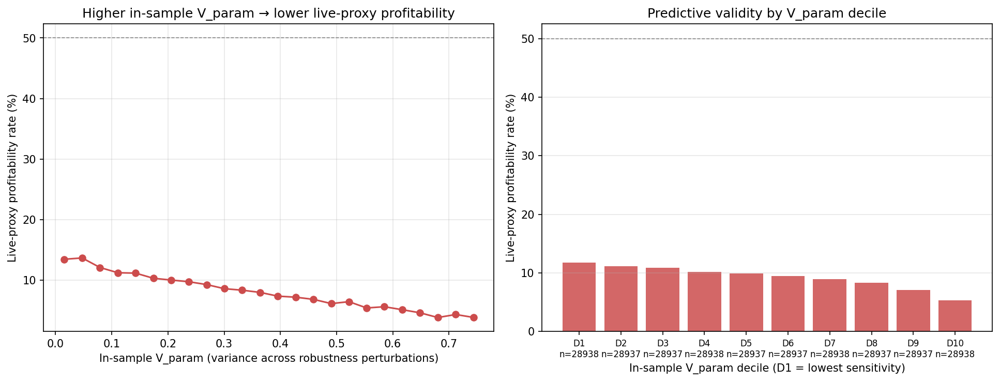
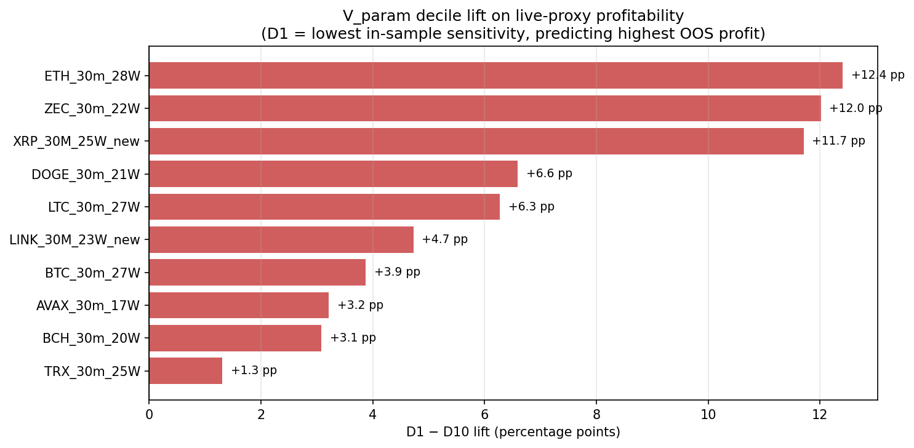
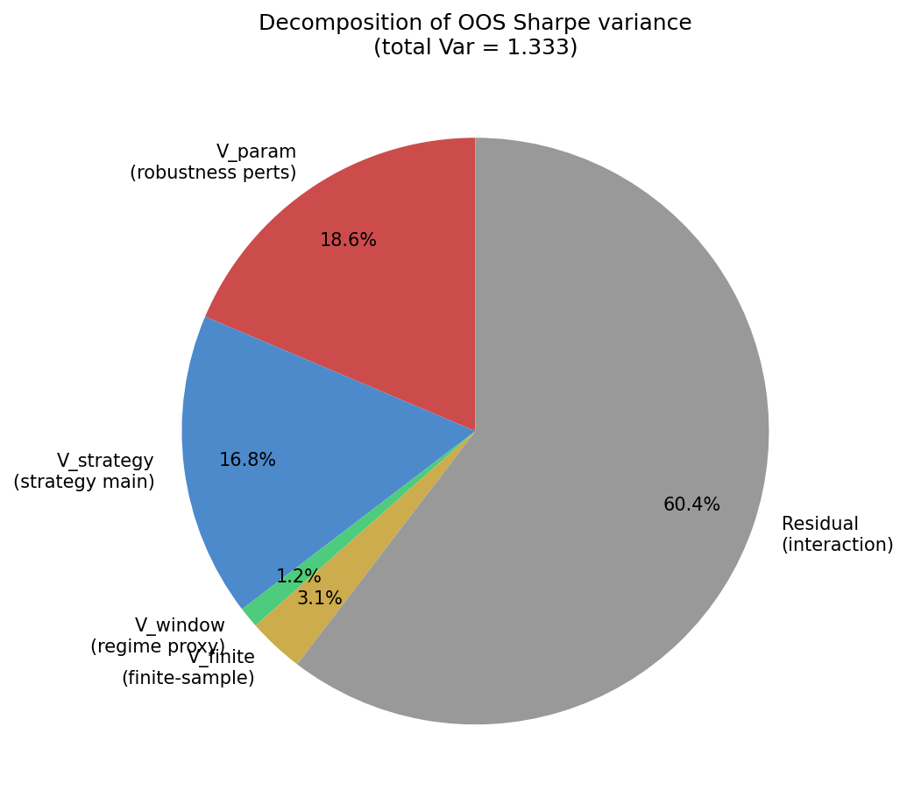
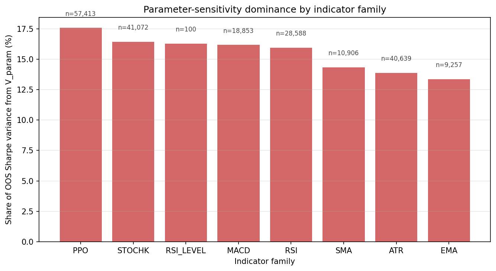

# strategy-overfitting

**Empirical variance decomposition of IS→OOS Sharpe degradation.**

> Companion repository to the M-series of reference implementations on
> [daru.finance](https://daru.finance). Inputs come from the
> [`quant-research-framework-rs`](https://github.com/DaruFinance/quant-research-framework-rs)
> walk-forward backtester, processed through
> [`strategy-generalization-analysis`](https://github.com/DaruFinance/strategy-generalization-analysis).

## What this is

A walk-forward backtester runs each strategy through `W` rolling
in-sample (IS) → out-of-sample (OOS) windows. For every (strategy,
window) the engine also re-runs four robustness perturbations on the OOS
period: entry drift (`ENT`), fee shock (`FEE`), slippage shock (`SLI`),
and entry-drift + indicator-variance (`ENT+IND`). Together with the
unperturbed run (`raw`), that gives five OOS Sharpe values per
(strategy, window).

This repo asks: **does the variance of those five values predict
out-of-sample profitability?** The answer turns out to be yes —
strategies whose Sharpe is fragile under small parameter perturbations
in-sample are more likely to fail on never-seen data.

The **live-proxy** is each strategy's last two WFO windows, evaluated
*after* the funnel filter (raw + ENT both profitable). It is the
training-time stand-in for "would this strategy still be profitable in
production?".

The decomposition splits OOS-Sharpe variance into:

- `V_param` — variance across the five perturbations (knife-edge sensitivity);
- `V_strategy` — between-strategy mean differences (strategy main effect);
- `V_window` — across-window means (a regime-shift proxy);
- `V_finite` — analytic finite-sample noise floor `(1 + 0.5·Sh²)/n`;
- residual interaction.

## Reproduce

```bash
git clone https://github.com/DaruFinance/strategy-overfitting
cd strategy-overfitting
pip install -e .
python scripts/overfitting.py            # default: real corpus
```

The default reads the strategies/ Parquet substrate at
`/mnt/d/strategies_parquet/strategies` (or pass `--parquet-root` /
`--assets ASSET1 ASSET2 ...` to point elsewhere) and writes
`figures/fig_decomposition_data.png`,
`figures/fig_param_vs_live_data.png`,
`figures/fig_decomp_by_family_data.png`,
plus `decomposition.json` with the variance shares and per-asset decile lift.

A `--synthetic` flag exists for testing the analysis pipeline in isolation
(three robust / fragile / noise classes, deterministic RNG); the real-data
path is the canonical mode.

## Problem statement

A walk-forward backtest produces, for each strategy `s` and window `w`, the
in-sample and out-of-sample Sharpe ratios under five perturbations
`t ∈ {raw, ENT, FEE, SLI, ENT+IND}`:

```
S_IS(s, w, t),  S_OOS(s, w, t)
```

Define the per-(s, w) parameter sensitivity:

```
V_param(s, w) = Var_t S_OOS(s, w, t)
```

and the IS→OOS degradation `D(s, w) = S_IS(s, w, raw) − S_OOS(s, w, raw)`.

A two-way decomposition of `Var(S_OOS_raw)` over the (strategy × window)
panel gives the share of OOS-Sharpe variance explained by each component.
Importantly, `V_param` is fully observable in-sample (using `S_IS`), making
it a candidate predictor of out-of-sample profitability.

## Headline result



On the **10 deepest-WFO assets** (≥17 walk-forward windows, all 30m crypto:
ETH, BTC, LTC, TRX, XRP, LINK, ZEC, DOGE, BCH, AVAX) — 7.27M OOS rows,
289,374 live-proxy candidates:

| Decile (D1 = lowest V_param) | Live-proxy profitable rate |
|---|---|
| D1 | 11.7% |
| D2 | 11.1% |
| D3 | 10.9% |
| D5 | 9.9% |
| D8 | 8.3% |
| D10 | 5.3% |

A 6.4-percentage-point spread (~2.2× lift) between the lowest- and
highest-sensitivity deciles, **monotonic across all ten deciles**. The
variance decomposition attributes 18.6% of pooled OOS-Sharpe variance to
V_param and 16.8% to between-strategy means; ~60% remains as residual /
interaction.



Per-asset breakdown (sorted by D1−D10 lift):

| Asset | live profit % | D1 % | D10 % | D1−D10 (pp) |
|---|---:|---:|---:|---:|
| ETH_30m_28W | 9.4% | 15.1 | 2.7 | **+12.4** |
| ZEC_30m_22W | 15.7% | 23.3 | 11.3 | **+12.0** |
| XRP_30M_25W_new | 14.1% | 18.9 | 7.2 | **+11.7** |
| DOGE_30m_21W | 14.6% | 18.0 | 11.4 | +6.6 |
| LTC_30m_27W | 4.7% | 7.6 | 1.3 | +6.3 |
| LINK_30M_23W_new | 6.2% | 9.1 | 4.3 | +4.7 |
| BTC_30m_27W | 8.4% | 10.0 | 6.1 | +3.9 |
| AVAX_30m_17W | 11.6% | 13.3 | 10.1 | +3.2 |
| BCH_30m_20W | 6.6% | 7.8 | 4.7 | +3.1 |
| TRX_30m_25W | 3.0% | 4.4 | 3.1 | +1.3 |

Three observations:

- **Every asset shows a positive D1−D10 lift.** No anti-signals or null
  results in the deep-WFO subset (TRX is the weakest at +1.3pp).
- **ETH, ZEC, XRP form a top tier** with 11.7–12.4 pp spreads — these
  are the cleanest empirical demonstrations that in-sample robustness
  predicts out-of-sample profitability.
- **The signal is strongest where the live-proxy rate is lowest.** LTC
  has 4.7% baseline profit but D1 = 7.6% (61% relative lift); ETH has
  9.4% baseline but D1 hits 15.1% (60% relative lift).

Mean IS→OOS Sharpe degradation across this corpus: **0.84**.

The variance decomposition pie:



By indicator family:



(An earlier full-30-asset run including 6W MetaW assets and 3 forex pairs
yielded a 5.0 pp spread — diluted by shorter-WFO crypto with weak signal
and an inverting AUDUSD (−2.7 pp lift). The 10-deepest subset is the
canonical headline for the predictive-validity claim.)

## Usage

```bash
# Full corpus (default):
python scripts/overfitting.py

# Subset of assets:
python scripts/overfitting.py --assets BTC_30m_27W DOGE_30m_21W

# Custom Parquet root:
python scripts/overfitting.py --parquet-root /path/to/strategies_parquet/strategies
```

## Data hygiene

Default filters before any analysis:

- Drop rows with `n_trades < 20` (small-N Sharpe is unreliable).
- Winsorise `sharpe` to `[-5, +5]` to bound a handful of strategies that hit
  ratio extremes from one or two large trades.

Both knobs are exposed in `load_metrics(parquet_root, min_trades, sharpe_clip)`.

## References

- Bailey, D. H. & López de Prado, M. (2014). *The deflated Sharpe ratio.*
- Harvey, C. & Liu, Y. (2014). *Backtesting.* JPM.
- López de Prado, M. (2018). *Advances in Financial Machine Learning*, ch. 11.
- See also the companion repo
  [`Monte-Carlo-paper`](https://github.com/DaruFinance/Monte-Carlo-paper)
  for the IS→OOS filter-MC framing this work extends.

## License

MIT © Daniel Vieira Gatto.
